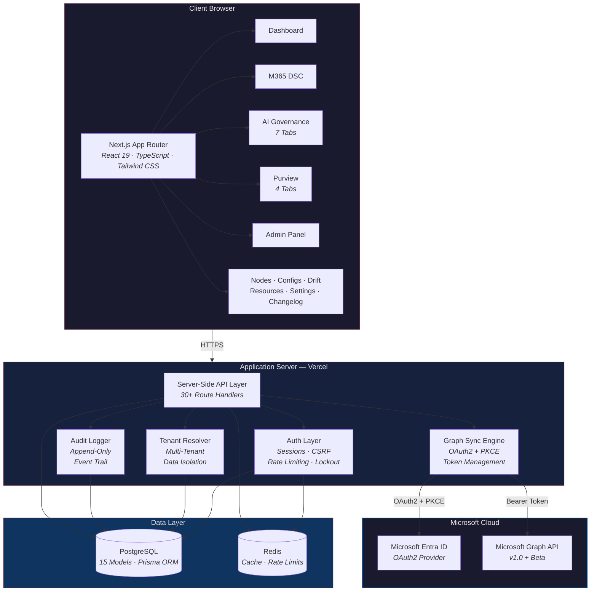
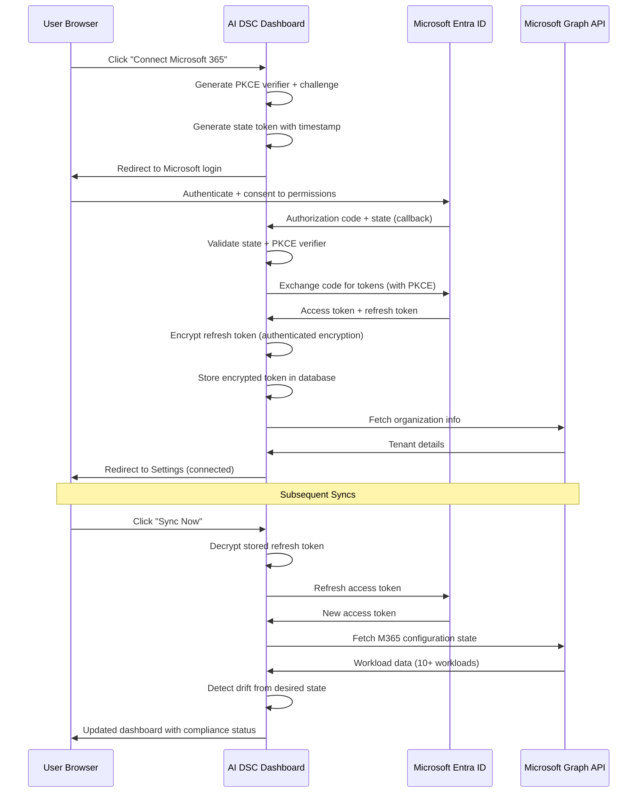
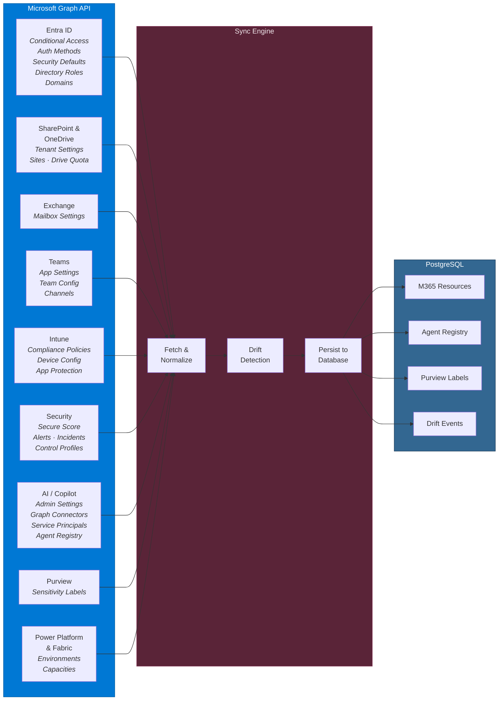
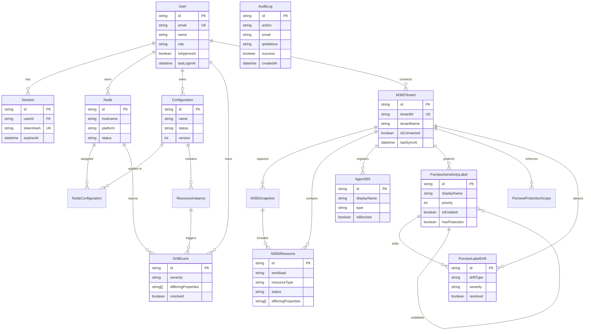
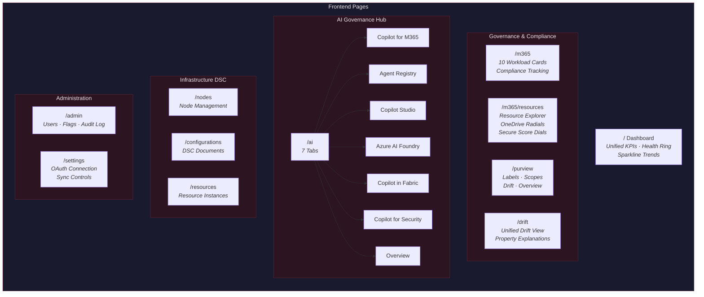
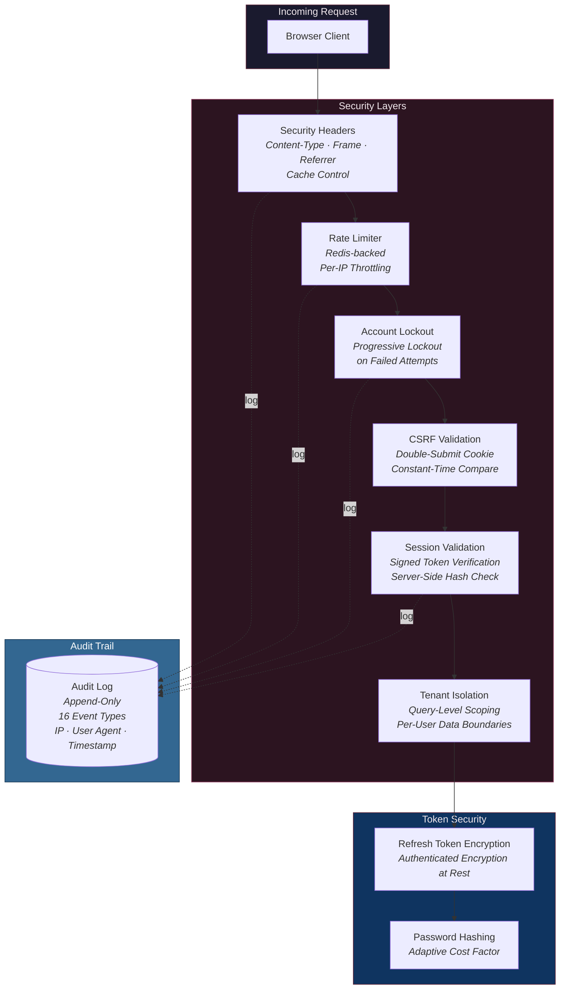

# AI DSC Dashboard

A full-stack Microsoft 365 governance and infrastructure compliance platform that unifies Desired State Configuration (DSC) monitoring, AI/Copilot governance, Purview data protection, and security posture management into a single real-time dashboard — powered by live Microsoft Graph API integration.

**Live:** [dsc-dashboard-vert.vercel.app](https://dsc-dashboard-vert.vercel.app)


---

## Summary

AI DSC Dashboard is a production-deployed web application that provides centralized visibility and governance across an organization's Microsoft 365 tenant. It connects to a live Azure AD tenant via OAuth2 + PKCE, pulls configuration state from Microsoft Graph API endpoints, and presents compliance status, drift detection, and security metrics across every major M365 workload.

The platform covers infrastructure DSC nodes, M365 tenant configurations (Entra ID, Exchange, SharePoint, Teams, Intune, Defender), Microsoft Purview sensitivity labels, AI/Copilot governance (Copilot for M365, Copilot Studio, Azure AI Foundry, Copilot in Fabric, Copilot for Security), and the Agent 365 Registry — all with real-time drift detection, per-property explanations sourced from Microsoft Learn documentation, and a persistent security audit trail.

Built as a solo full-stack project demonstrating end-to-end ownership: authentication system design, OAuth2 integration, encrypted token management, multi-tenant data isolation, API design, database modeling, and production deployment.

---

## Key Features

### Unified Compliance Dashboard
- Cross-source KPIs aggregating infrastructure nodes, M365 resources, Copilot agents, and Purview labels
- Health ring chart with per-source sparkline trend charts
- Tenant live data section showing auth methods, domains, Teams, sites, and OAuth grants

### Microsoft 365 DSC Monitoring
- Live sync across 10 workloads: Entra ID, Exchange, SharePoint, Teams, Intune, Defender, OneDrive, Power Platform, Fabric, Security & Compliance
- Workload compliance cards with drill-down resource explorer
- Import flow for `Microsoft365DSC` JSON report output
- OneDrive storage metrics with radial dial charts and capacity forecasting
- Secure Score visualization with letter grades and enabled services

### AI Governance Hub (7 Tabs)
- **Copilot for M365** — Admin settings, Graph connectors with schema counts, Teams AI apps, OAuth consent grants
- **Agent Registry** — Agent types, deployment status, governance alerts, risk tracking
- **Copilot Studio** — Agent governance controls, declarative vs custom engine agents
- **Azure AI Foundry** — Secure Score radial, AI-relevant security controls, model deployment cards
- **Copilot in Fabric** — Capability readiness, admin configuration, capacity SKU visualization
- **Copilot for Security** — Security alerts, incidents, Secure Score controls with progress bars
- **Overview** — Aggregated metrics, agent donut chart, connector health grid, service principal status
- All metric cards are clickable with animated drill-down modals showing underlying data

### Microsoft Purview Integration
- Sensitivity label hierarchy synced from Graph API
- Protection scope monitoring with DLP policy action tracking
- Label drift detection with severity-based resolve workflow

### Drift Detection & Explanations
- Per-property drift breakdown with desired vs actual state comparison
- Property-specific explanations sourced from official Microsoft Learn documentation
- Each drift event shows Description, Risk, Recommendation, and direct doc link
- Unified drift view across Infrastructure DSC, M365 DSC, and Purview sources

### Security
- Industry-standard password hashing and session management
- Encrypted OAuth2 token storage at rest
- PKCE-protected OAuth2 flow — no client secrets from user tenants stored
- Redis-backed rate limiting and account lockout
- Multi-tenant data isolation — users only see their own tenant data
- Persistent database-backed audit log tracking all auth events
- CSRF protection, secure cookie configuration, and security response headers
- Input validation on all API request bodies
- Admin approval required for new user accounts

### Admin Controls
- User management with approval queue, promote/demote, session tracking
- Feature flag toggles to control page visibility for all users
- Audit Log tab with filterable, paginated security event trail

---

## System Architecture



---

## OAuth2 Connection Flow



---

## Data Sync Architecture



---

## Database Entity Relationship Diagram



---

## Application Page Architecture



---

## Security Architecture



---

## Tech Stack

| Layer | Technology | Purpose |
|-------|-----------|---------|
| Framework | Next.js (App Router) | Full-stack React framework with server components |
| Language | TypeScript | Type-safe development across frontend and backend |
| Styling | Tailwind CSS | Utility-first CSS with custom dark theme |
| UI Primitives | Radix UI | Accessible dialog, dropdown, tabs, tooltip, select |
| Charts | Recharts | Radial dials, sparklines, compliance visualizations |
| Database | PostgreSQL | Primary relational data store (15 models via Prisma ORM) |
| Cache | Redis | Response caching, rate limiting, session management |
| Auth | Custom | Password hashing, JWT sessions, CSRF, rate limiting, audit log |
| Encryption | Node.js crypto | Encrypted token storage, secure hashing |
| OAuth2 | Microsoft Identity Platform | Authorization Code + PKCE, multi-tenant |
| API Integration | Microsoft Graph | M365 tenant configuration and compliance data |
| Validation | Zod | Runtime schema validation on all inputs |
| Hosting | Vercel | Production deployment with edge network |

---

## Services & Infrastructure

| Service | Role |
|---------|------|
| **Vercel** | Application hosting and edge CDN |
| **PostgreSQL** | Primary relational database |
| **Redis** | Caching and rate limiting |
| **Microsoft Entra ID** | OAuth2 identity provider (multi-tenant) |
| **Microsoft Graph API** | M365 tenant configuration data source |
| **GitHub** | Source control and CI/CD |

---

## Quick Start

```bash
git clone https://github.com/justinericsnyder/M365DSCDash.git
cd M365DSCDash/dsc-dashboard
npm install
cp .env.example .env   # Configure required environment variables
npx prisma generate && npx prisma db push
npm run dev
```

See `.env.example` for required configuration variables.

---

## License

Private repository. All rights reserved.
